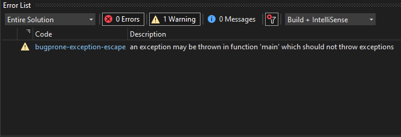

# Certification Prep
This project is a practice program designed to help prepare for the CPA Exam, for the Certified Associate Programmer Certification. 

The project was made for COP 3003.

## Demonstration

## Documentation/Diagrams
[Doxygen](https://joshual03.github.io/Certification-Prep/html/)

## Getting Started

## Built With
Microsoft Visual Studio

## Contributing
Feel free to contact me through GitHub if you would like to contribute to this project. Though it is primarily aimed at reinforcing my knowledge of C++ and object-oriented programming, I am open to any improvements and updates.

## Author
Joshua Lopez

## License

## Acknowledgments
- stackoverflow.com
- geeksforgeeks.org
- learncpp.com
- cppreference.com
- cplusplus.com
- github.com

## History
Most recently, Doxygen documentation has been added, alongside more reformatting of code.

## Key Programming Concepts Utilized
- Classes
- Subclasses with inheritance
- Encapsulation
- Polymorphism
- Dynamic dispatch
- Function overloading
- Exception handling
- Passing functions as arguments
- Interfaces
- Virtual functions and overriding
- Initialization lists
- Overloading constructors